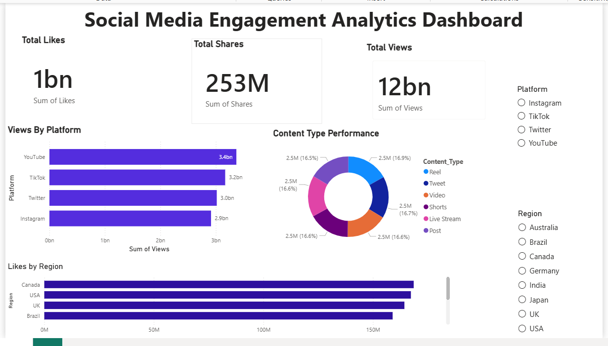

#  Social Media Engagement Dashboard (Power BI)

## Overview
This project analyzes social media engagement across multiple platforms to identify trends in user interaction and content performance.

## Key Insights
- Identified highest engagement platform based on likes, shares, and views
- Compared performance across YouTube, TikTok, Twitter, and Instagram
- Analyzed content type distribution to understand what drives engagement
- Explored regional engagement patterns for targeted strategy

## Tools Used
- Power BI (Data Visualization)
- Data Cleaning & Transformation
- DAX (KPIs and calculated metrics)

## Dashboard Preview

## Files
- Social Media Engagement Dashboard.pbix → Power BI file
- dashboard_preview.png → Dashboard image

## Why This Project Matters
This dashboard helps businesses understand where to focus their content strategy by identifying high-performing platforms, content types, and regions.
